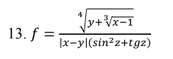
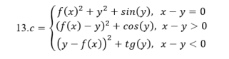
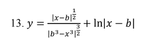

# Практическая работа №4

## Дисциплина
Поддержка и тестирование программных модулей

## Название практической работы
Тестирование "Белым ящиком"

## Цель работы
Приобрести практические навыки ручного тестирования методом "белого ящика".

## Разработчики
Студенты Николаева Мария и Погосян Эдик группы 3ИСИП-223

## Вариант задания: 13

### Задание 1

### Задание 2

### Задание 3

## Стек технологий

| Технология | Назначение |
|------------|------------|
| C# 7.0 | Язык программирования |
| WPF (.NET Framework) | Платформа для создания desktop-приложений |
| XAML | Язык разметки интерфейса |
| WindowsFormsHost | Интеграция WinForms элементов |
| System.Windows.Forms.DataVisualization.Charting | Построение графиков функций |
| Git | Система контроля версий |

## Архитектура приложения

### Корневая папка проекта
- MainWindow.xaml.cs - главное окно с TabControl
- CheckInput.cs - класс для валидации ввода
- README.md - документация проекта

### Pages/ - страницы с заданиями
- _1TaskPage.xaml.cs - задание 1 
- _2TaskPage.xaml.cs - задание 2
- _3TaskPage.xaml.cs - задание 3

### Images/ - изображения формул
- Task1.png - формула для задания 1
- Task2.png - формула для задания 2
- Task3.png - формула для задания 3

