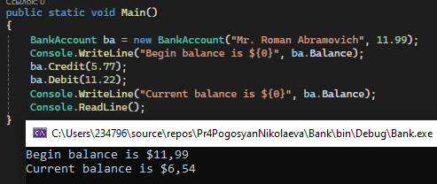
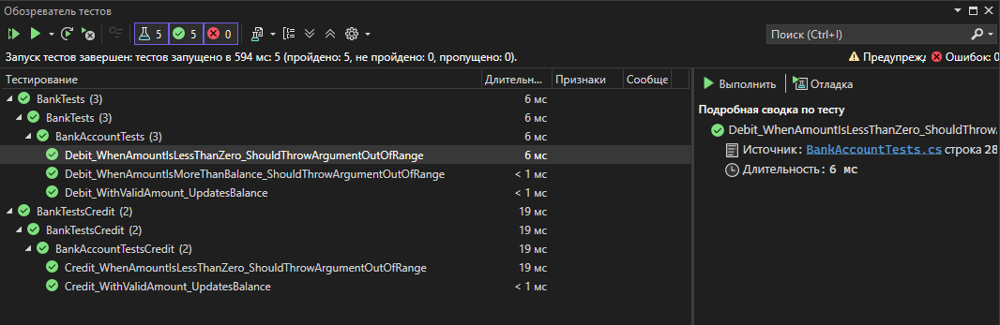

## Практическая работа №6.1
Дисциплина:
Поддержка и развитие программных модулей
### Название практической работы: Создание автоматизированных unit-тестов
## Разработчики
Студенты Николаева Мария и Погосян Эдик группы 3ИСИП-223

Все пять тестов успешно пройдены.
- Метод Debit корректно изменяет баланс при валидных значениях и выбрасывает исключения с ожидаемыми сообщениями при попытке снятия отрицательной суммы или суммы, превышающей остаток;

- Метод Credit корректно увеличивает баланс и выбрасывает исключение при попытке пополнения на отрицательную сумму.