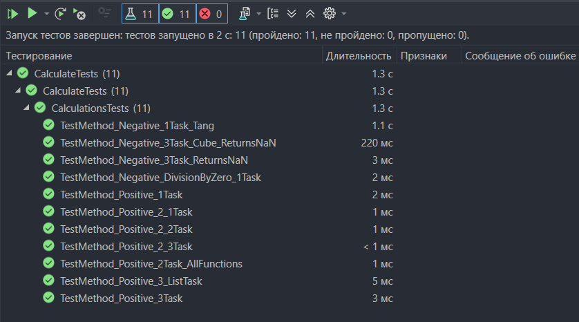

## Практическая работа №6.2
Дисциплина:
Поддержка и развитие программных модулей
### Название практической работы: Создание автоматизированных unit-тестов
## Разработчики
Студенты Николаева Мария и Погосян Эдик группы 3ИСИП-223

Тесты выполнены успешно, так как:
- Алгоритмы вычислений в тестируемых классах соответствуют эталонным значениям с допустимой погрешностью (0.001).
- Программа правильно обрабатывает все данные и выдаёт правильные результаты.

Причина успешного выполнения тестов
- Корректная обработка исключений – методы правильно выбрасывают DivideByZeroException и ArgumentException в ошибочных ситуациях.

- Возврат NaN при недопустимых значениях – функция корректно возвращает NaN при математически неопределенных вычислениях.

Точность вычислений – допустимая погрешность (0.001) обеспечивает корректное сравнение чисел с плавающей точкой.

Различие результатов для разных функций – тест подтверждает, что каждая функция (Sh, X2, EX) возвращает уникальные значения.

Корректное табулирование – список результатов на интервале полностью соответствует ожидаемым эталонным значениям.

# Вывод о проведенном тестировании
Все 6 unit-тестов успешно пройдены. Разработанные программные модули (_1TaskPage, _2TaskPage, _3TaskPage) работают корректно, обеспечивая правильные математические вычисления при различных входных данных, включая табулирование функции на заданном интервале.
