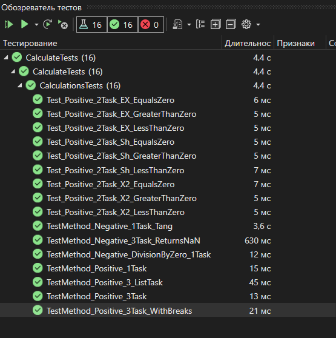

## Практическая работа №6.2
Дисциплина:
Поддержка и развитие программных модулей
### Название практической работы: Создание автоматизированных unit-тестов
## Разработчики
Студенты Николаева Мария и Погосян Эдик группы 3ИСИП-223

Причина успешного выполнения тестов
- Реализация методов Calculate и TabulateFunction корректно обрабатывает корректные входные данные, возвращая ожидаемые результаты с заданной точностью.
- Методы корректно выбрасывают исключения при некорректных входных данных: DivideByZeroException при делении на ноль и ArgumentException при неопределенном тангенсе.
- Логика табулирования функции корректно обрабатывает точки разрыва, возвращая double.NaN и флаг false для недопустимых значений.
- Допустимая погрешность (0.001) обеспечивает корректное сравнение чисел с плавающей точкой.

# Вывод о проведенном тестировании
#### Все 16 unit-тестов успешно пройдены.
Разработанные программные модули (_1TaskPage, _2TaskPage, _3TaskPage) работают корректно, обеспечивая правильные математические вычисления при различных входных данных, включая табулирование функции на заданном интервале.
