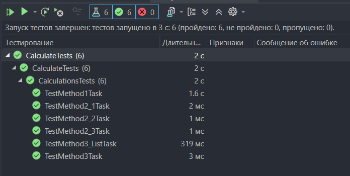

## Практическая работа №6.2
Дисциплина:
Поддержка и развитие программных модулей
### Название практической работы: Создание автоматизированных unit-тестов
## Разработчики
Студенты Николаева Мария и Погосян Эдик группы 3ИСИП-223

Тесты выполнены успешно, так как:
- Алгоритмы вычислений в тестируемых классах соответствуют эталонным значениям с допустимой погрешностью (0.001).
- Программа правильно обрабатывает все данные и выдаёт правильные результаты.

# Вывод о проведенном тестировании
Все 6 unit-тестов успешно пройдены. Разработанные программные модули (_1TaskPage, _2TaskPage, _3TaskPage) работают корректно, обеспечивая правильные математические вычисления при различных входных данных, включая табулирование функции на заданном интервале.
